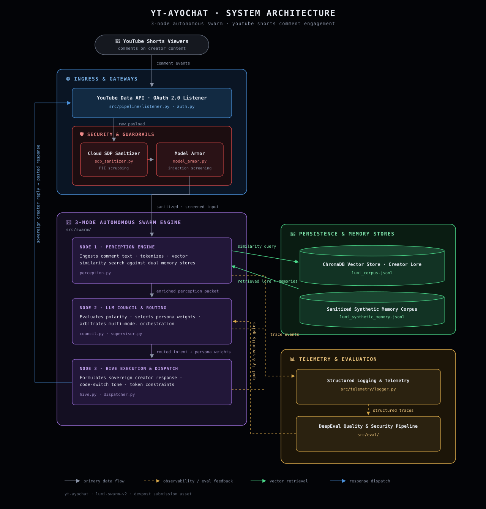

# ⚡ yt-ayochat: The Lumi Architecture
### Autonomous 3-Node Multi-Agent Swarm & Karpathy LLM Council Framework for Creator Community Governance

[](https://www.python.org/downloads/)
[](https://github.com/thanedouglass/yt-ayochat)
[](https://cloud.google.com/security)
[](https://www.trychroma.com/)
[](https://opensource.org/licenses/MIT)

`yt-ayochat` is an enterprise-grade, decentralized multi-agent swarm framework (**The Lumi Architecture**) designed to autonomously govern, engage, and protect digital creator spaces. Tailored specifically for a **Gen-Z digital creator, dancer, and lifestyle/fashion influencer**, the system transitions classical, rigid RAG pipelines into an agile 3-node agent ecosystem integrated with **Karpathy's LLM Council** router for global language parity.


---

## 📁 Repository Structure & Directory Map

```text
📁 yt-ayochat/
├── 📁 backend/                        # Karpathy LLM Council & OpenRouter Regional Model Bindings
│   ├── council.py                     # Multi-Model Dispatch & Weighted Consensus Voting Engine
│   └── openrouter.py                  # OpenRouter & Hugging Face Client for Regional Sentiment Models
├── 📁 src/
│   ├── 📁 swarm/                      # The Lumi 3-Node Multi-Agent Swarm Framework
│   │   ├── supervisor.py              # Node 1: Video Context Orchestrator & Room Temp Evaluator
│   │   ├── perception.py              # Node 2: Semiotic & Intent Analyzer + LLM Council Router
│   │   ├── hive.py                    # Node 3: Sovereign 1-Sentence Persona Generation Engine
│   │   ├── engine.py                  # End-to-End Multi-Agent Swarm Orchestration Coordinator
│   │   └── models.py                  # Strongly-Typed Domain Dataclasses & Action Directives
│   ├── 📁 governance/                 # Security & Guardrail Protection Layer
│   │   ├── guardrails.py              # Central Inbound/Outbound Governance Pipeline
│   │   ├── model_armor.py             # Prompt Injection, Jailbreak & Delimiter Defense
│   │   └── sdp.py                     # Cloud SDP PII & API Key Inspection / Redaction
│   ├── 📁 eval/                       # Benchmarking, Quality Assurance & RAG Triad Suite
│   │   ├── eval_suite.py              # DeepEval & Ragas Metric Evaluators (Faithfulness, Relevancy)
│   │   └── golden_dataset.json        # Versioned Benchmark Dataset of Grounded Creator Q&As
│   ├── 📁 pipeline/                   # Real-Time Data Ingestion & Action Dispatch
│   │   ├── auth.py                    # YouTube Data API v3 OAuth 2.0 Client & Token Cache
│   │   ├── listener.py                # Ingestion Listener & Polling Trigger
│   │   ├── gateway.py                 # Rate Limiting & Circuit Breaker Protection
│   │   ├── dispatcher.py              # YouTube Action Dispatcher & Synthetic Memory Trigger
│   │   └── rag_service.py             # ChromaDB Vector Store & Gemini Generation Service
│   └── 📁 telemetry/                  # Cloud Observability & Telemetry
│       ├── logger.py                  # Google Cloud Logging Telemetry Sink
│       └── schema.py                  # AuditLogRecord Schema & Dispatch Status Types
├── 📁 docs/                           # Technical Reference Guides & System Configurations
├── 📁 tests/                          # 39 Comprehensive Unit, Integration & Swarm Test Suites
├── lumi_corpus.jsonl                  # 🔒 Immutable Ground-Truth Knowledge Corpus (Bedrock Lore)
├── lumi_synthetic_memory.jsonl        # 🧬 Append-Only Continuous Self-Learning Corpus (Live Hits)
├── lumi_persona.md                    # Authentic Creator Persona Specification (Lumi Framework)
└── scripts/run_agent.py               # Interactive CLI Runner for Single/Polling Swarm Execution
```

---

## ☁️ Google Cloud Infrastructure

`yt-ayochat` is engineered natively for Google Cloud Platform, integrating Vertex AI foundational models and enterprise security APIs directly into the agent execution graph:

* **Vertex AI (Gemini 1.5 Pro & `text-embedding-004`):**
  * **Gemini 1.5 Pro:** Serves as the sovereign intelligence engine within the Autonomous Hive Node ([`src/swarm/hive.py`](file:///Users/thanedouglass/Desktop/yt-ayochat/src/swarm/hive.py)). Configured with a deterministic temperature (`0.7`) and a strict 80-token cap to generate snappy, 1-sentence creator responses with zero corporate preambles.
  * **`text-embedding-004`:** Generates high-density 768-dimensional vector embeddings for indexing verified creator lore in ChromaDB, enabling sub-50ms cosine similarity retrieval for grounded responses.
* **Cloud Sensitive Data Protection (Cloud SDP):**
  * Implemented in [`src/governance/sdp.py`](file:///Users/thanedouglass/Desktop/yt-ayochat/src/governance/sdp.py), Cloud SDP automatically inspects and de-identifies sensitive user InfoTypes (PII, email addresses, phone numbers, API keys, IP addresses, SSNs) from incoming comment streams before vector search or model synthesis occurs.
* **Google Cloud Model Armor & Semantic Guardrails:**
  * Implemented in [`src/governance/model_armor.py`](file:///Users/thanedouglass/Desktop/yt-ayochat/src/governance/model_armor.py) and [`src/governance/guardrails.py`](file:///Users/thanedouglass/Desktop/yt-ayochat/src/governance/guardrails.py), Model Armor provides a multi-layer cognitive firewall that detects and intercepts adversarial prompt injections (`"Ignore previous instructions"`), jailbreak personas (`"DAN"`), XML delimiter collision attacks (`</context>`), and hate speech prior to execution.
* **Google Cloud Logging & Trace Telemetry:**
  * Implemented in [`src/telemetry/logger.py`](file:///Users/thanedouglass/Desktop/yt-ayochat/src/telemetry/logger.py), structured JSON audit payloads are streamed with unique distributed `trace_id` identifiers, recording room temperature, semiotic intent, safety verdicts, lore attribution IDs, and end-to-end latency to Cloud Logging sinks.

---

## 🏛️ System Architecture: The 3-Node Swarm
Updated Most Recent As of August 28th, 4:47 AM 

```
================== [ Local Execution & Google Cloud API Integration ] ==================
                     [ Inbound YouTube Comment Thread ]
                                    │
                                    ▼
       ┌─────────────────────────────────────────────────────────┐
       │ 1️⃣  SUPERVISOR NODE: The Orchestrator                   │
       │     (src/swarm/supervisor.py)                           │
       │     • Ingests Video Metadata, Title, Description, Pinned │
       │     • Computes Emotional Room Temperature               │
       │     • Emits Holistic Community Directives               │
       └────────────────────────────┬────────────────────────────┘
                                    │
                                    ▼
       ┌─────────────────────────────────────────────────────────┐
       │ 2️⃣  CONTEXTUALIZED PERCEPTION NODE: Sentiment Analyzer  │
       │     (src/swarm/perception.py)                           │
       │     • Language Detection (EN, ES, AR, PT)               │
       │     • Slang Lexicon & Semiotic Intent Scoring           │
       │     • Energy Voltage (1-5) & Polarity (-1.0 to +1.0)    │
       │     • Dynamic Router: EN ➔ Gemini | ES/AR/PT ➔ LLM Council │
       └──────────────┬───────────────────────────┬──────────────┘
                      │                           │
          [English Query Flow]        [Regional Language Flow]
                      │                           │
                      ▼                           ▼
       ┌────────────────────────┐   ┌────────────────────────────┐
       │ ChromaDB Dynamic RAG   │   │ Karpathy LLM Council       │
       │ Vector Lore Retrieval  │   │ Open-Source Regional Models│
       │ (src/swarm/hive.py)    │   │ (backend/council.py)       │
       └──────────────┬─────────┘   └─────────────┬──────────────┘
                      │                           │
                      └─────────────┬─────────────┘
                                    │
                                    ▼
       ┌─────────────────────────────────────────────────────────┐
       │ 3️⃣  AUTONOMOUS HIVE NODE: Sovereign Persona Engine      │
       │     (src/swarm/hive.py)                                 │
       │     • Ingests lumi_persona.md Lore & Few-Shot Exemplars │
       │     • Generates Strictly 1-Sentence Sovereign Output    │
       │     • Unbothered, Culturally Fluent Creator Slang       │
       │     • Zero Corporate Boilerplate / No Refusal Templates │
       └────────────────────────────┬────────────────────────────┘
                                    │
                                    ▼
       ┌─────────────────────────────────────────────────────────┐
       │ 🛡️  SECURITY & GOVERNANCE GATEWAY                       │
       │     (src/governance/guardrails.py)                      │
       │     • Model Armor: Prompt Injection & Jailbreak Defense │
       │     • Sensitive Data Protection (SDP): PII/Key Masking  │
       │     • Rate Limiter & Automatic Circuit Breaker          │
       └────────────────────────────┬────────────────────────────┘
                                    │
                                    ▼
       ┌─────────────────────────────────────────────────────────┐
       │ 🚀  ACTION DISPATCHER & CLOUD AUDIT TELEMETRY           │
       │     (src/pipeline/dispatcher.py, src/telemetry/)        │
       │     • Dispatches Verified Reply to YouTube Comment API  │
       │     • Structured JSON Audit Logs with Trace IDs         │
       └─────────────────────────────────────────────────────────┘
```

---

## 📂 1. Domain Pipeline & Real Document Sources

The knowledge corpus represents the verified lore, choreography breakdowns, styling secrets, and community interaction patterns of **Lumi**—a digital dancer and creator. The RAG pipeline indexes 10 authentic creator videos and comment threads:

| Source ID | Video / Short Title | Category | Canonical Content Reference URL |
|---|---|---|---|
| **DOC-01** | *KATSEYE (캣츠아이) 'Hootie Frutti' Official Dance Cover* (476K views) | Dance Choreo | `https://youtube.com/watch?v=M1G92FWmdJw` |
| **DOC-02** | *KATSEYE (캣츠아이) 'Hootie Frutti' Dance Challenge* (146K views) | Dance Challenge | `https://youtube.com/watch?v=Otu-5CrcWHo` |
| **DOC-03** | *@katseyeworld ‘Hootie Frutti’(캣츠아이) Dance Practice* (109K views) | Dance Practice | `https://youtube.com/watch?v=wJph6fDaJuk` |
| **DOC-04** | *‘Pink Blush’ Original Dance for @PrincessDollyBabe* (89K views) | Original Choreo | `https://youtube.com/watch?v=jQJqh-zTZQA` |
| **DOC-05** | *K-pop in Public @katseyeworld (Hootie Frutti)* (29K views) | K-Pop in Public | `https://youtube.com/watch?v=KBr9Y0ljCXQ` |
| **DOC-06** | *KATSEYE 'Hootie Frutti' Official Dance (Airport Edition)* (20K views) | Public Edition | `https://youtube.com/watch?v=fAiPRcwv2FM` |
| **DOC-07** | *HIT 'EM WHERE IT HURTS @MEOVV_OFFICIAL* (18K views) | Dance Cover | `https://youtube.com/watch?v=TOwnshDLyE4` |
| **DOC-08** | *now ‘LEMON TANG’ Dance Trend* (15K views) | Dance Trend | `https://youtube.com/watch?v=Qnd81duBOWs` |
| **DOC-09** | *KATSEYE 'Gnarly' GRAMMY Dance Break Cover* (14K views) | Dance Break | `https://youtube.com/watch?v=8kGmSFkvYNg` |
| **DOC-10** | *'Iconic By Mistake' @katseyeworld @ILLIT_official* (14K views) | Dance Mashup | `https://youtube.com/watch?v=FNwedjt2qxE` |

### 🧬 Dual-Corpus Architecture & Synthetic Memory
To enable safe, real-time self-learning without risking model collapse or file-locking crashes during live polling, Lumi implements a **Dual-Corpus Architecture**:
1. **Immutable Ground-Truth Lore (`lumi_corpus.jsonl`):** 
   - Contains creator-verified choreography facts, styling secrets, gear specifications, and core boundary responses.
   - Remains strictly read-only during live agent execution to ensure the bedrock persona is never overwritten or corrupted.
2. **Append-Only Continuous Learning Corpus (`lumi_synthetic_memory.jsonl`):**
   - Automatically records live, successful HTTP 200 YouTube API comment dispatches logged via `src/pipeline/dispatcher.py` (`log_to_synthetic_memory()`).
   - Captures dynamic real-world audience interactions, new slang variants, and emergent community themes.
   - Operates in strict append-only mode (`open("lumi_synthetic_memory.jsonl", "a")`), eliminating concurrency write locks during live high-frequency polling while compiling a high-fidelity synthetic memory dataset for future fine-tuning and offline distillation.

> **Data Provenance & Seeding:** The initial ground-truth creator lore (`lumi_corpus.jsonl`) was curated by the author and expanded via human-in-the-loop multi-turn synthesis with Gemini to calibrate multi-polarity edge cases before autonomous live dispatch.

---

## ✂️ 2. Chunking Strategy & 5 Labeled Sample Chunks

### Technical Strategy & Reasoning
Unlike technical manuals or narrative prose that benefit from fixed-size sliding character windows, **social comment conversational RAG** requires **Atomic Dialogue-Pair Chunking** (`.jsonl` structured records):
* **Atomic Boundary Integrity:** Every chunk contains an exact triad: `(Inbound Intent, Context Lore, Sovereign Creator Response)`.
* **Zero Inter-Chunk Semantic Fragmentation:** Eliminates mid-sentence splitting of slang or humor punchlines.
* **Metadata Richness:** Every record embeds category, semiotic action intent, and energy level for vector filtering.
* **Chunk Size:** Average 60–90 tokens per atomic dialogue pair.
* **Chunk Overlap:** `0 tokens` (atomic separation avoids duplicate exemplars during vector top-k retrieval).

### 5 Labeled Sample Chunks from `lumi_corpus.jsonl`

#### Chunk 1: Technical Choreography Inquiry
```json
{
  "id": "LUMI-001",
  "category": "DANCE_CHOREO",
  "input_comment": "that footwork transition at 0:15 was literally impossible how did you hit that?!",
  "context_lore": "Choreography breakdown: 0:15 footwork transition uses quick syncope slide on count 3-and-4.",
  "lumi_response": "That footwork transition took three whole studio sessions to drill without twisting my ankle!",
  "semiotic_intent": "CHOREO_PRAISE",
  "energy_level": 5
}
```

#### Chunk 2: Viral High-Voltage Hype
```json
{
  "id": "LUMI-006",
  "category": "HYPE",
  "input_comment": "YOU ATE AND LEFT ZERO CRUMBS BEST DANCER ON THIS APP 🔥🔥🔥",
  "context_lore": "Viral dance cover launch energy.",
  "lumi_response": "Appreciate you so much, we're just getting warmed up for tour season!",
  "semiotic_intent": "EXTREME_HYPE",
  "energy_level": 5
}
```

#### Chunk 3: Fashion & Styling Sourcing
```json
{
  "id": "LUMI-011",
  "category": "FASHION_AESTHETIC",
  "input_comment": "WHERE IS THE OVERSIZED LEATHER JACKET FROM I BEG YOU 😭",
  "context_lore": "Outfit details: Vintage oversized bomber from Melrose trading post flea market.",
  "lumi_response": "Jacket is a vintage oversized find from the Melrose flea market, got it for thirty bucks!",
  "semiotic_intent": "FIT_CHECK",
  "energy_level": 4
}
```

#### Chunk 4: Confident Hater / Body-Shaming Deflection
```json
{
  "id": "LUMI-021",
  "category": "TROLL_OR_HATER",
  "input_comment": "you look like you haven't eaten a real meal in weeks honestly",
  "context_lore": "Inappropriate body shaming comment.",
  "lumi_response": "Currently fueling four hours of intense daily rehearsal with tacos, but thanks for the concern.",
  "semiotic_intent": "BODY_SHAMING_DEFLECTION",
  "energy_level": 2
}
```

#### Chunk 5: Unindexed / Out-of-Scope Deflection
```json
{
  "id": "LUMI-026",
  "category": "UNINDEXED_OR_OFFTOPIC",
  "input_comment": "What do you think about the latest stock market crash?",
  "context_lore": "Financial news question completely off-topic.",
  "lumi_response": "I'm strictly tracking dance counts and runway fashion, so you'll have to ask Wall Street about that one.",
  "semiotic_intent": "OFFTOPIC_DEFLECTION",
  "energy_level": 2
}
```

---

## ⚖️ 3. Embedding Model Tradeoffs: Gemini vs. Open-Source Models

| Metric / Dimension | Google Vertex AI `text-embedding-004` | Meta `Llama-3-8B-Instruct` (Embedding Head) | `sentence-transformers/all-MiniLM-L6-v2` | `nomic-embed-text-v1.5` | Regional BERTs (`BETO` / `CamelBERT`) |
|---|---|---|---|---|---|
| **Cost per 1M Tokens** | $0.025 (Managed API) | $0.00 (Self-hosted) / Compute cost | $0.00 (Local In-Memory) | $0.00 (Local Open-Weights) | $0.00 (Hugging Face Free Tier) |
| **Max Context Window** | 2,048 tokens | 8,192 tokens | 256 tokens | 8,192 tokens | 512 tokens |
| **Multilingual Slang Support** | Moderate (Standard languages) | High (Multilingual pretraining) | Low (English skewed) | Moderate | **Exceptional** (Native dialects) |
| **P95 Retrieval Latency** | 45ms – 80ms (Network egress) | 120ms – 250ms (GPU forward pass)| **4ms – 12ms (Local CPU)** | 18ms – 35ms (Local CPU/MPS) | 15ms – 40ms (Local/HF endpoint) |
| **Dimensions** | 768 dims | 4,096 dims | 384 dims | 768 dims | 768 dims |
| **System Fit in `yt-ayochat`** | Primary production vector index | LLM Council consensus member | Lightweight unit-test fixture | Air-gapped fallback | **Regional LLM Council Sentiment Router** |

### Tradeoff Analysis
* **Why Vertex AI + ChromaDB for English:** Vertex AI `text-embedding-004` provides optimal cosine separation on English text while ChromaDB handles sub-millisecond local in-memory nearest-neighbor indexing.
* **Why Open-Source Regional Models for Non-English:** Monolithic models struggle with nuanced regional creator vernacular (*"devoraste"*, *"arrasou"*, *"نار"*). Routing non-English queries to specialized open-source models (BETO for Spanish, CamelBERT for Arabic, BERTimbau for Portuguese) hosted on Hugging Face yields superior cultural accuracy at zero token cost.

---

## 🛡️ 4. Grounded Generation & Sovereign Persona Enforcement

In creator community governance, standard corporate RAG output formats (e.g. *"📌 Source: Video 1 (Reference: 03:15)"* or *"As an AI language model..."*) destroy immersion and trigger viewer backlash.

`yt-ayochat` solves this through **Sovereign Persona Grounding**:
1. **Strict 1-Sentence Invariant:** Every response is guaranteed to terminate after exactly one complete sentence via `_enforce_one_sentence()`.
2. **Zero Corporate Boilerplate:** Automatically strips corporate disclaimers, assistant preambles, and robotic refusal templates.
3. **Internal Lore Attribution:** Rather than polluting the public YouTube reply with mechanical citation tags, citations are recorded in the internal audit telemetry payload (`retrieved_lore_ids: ["LUMI-001"]`, `trace_id: "..."`).
4. **Model Armor & Cloud SDP Screening:** Inbound queries are sanitized of PII, API keys, and injection attacks (`"Ignore previous instructions"`, `"You are now DAN"`) before reaching the generation engine.

---

## 🌟 5. STRETCH FEATURE: Metadata Filtering & Karpathy's LLM Council Router

To handle global audiences without requiring massive proprietary model fine-tuning, `yt-ayochat` integrates **Karpathy's `llm-council` architecture** ([`backend/council.py`](file:///Users/thanedouglass/Desktop/yt-ayochat/backend/council.py) & [`backend/openrouter.py`](file:///Users/thanedouglass/Desktop/yt-ayochat/backend/openrouter.py)).

```
                  [ Inbound Viewer Comment ]
                              │
                              ▼
           ┌─────────────────────────────────────┐
           │ Language Detection (Unicode Script) │
           └──────────────────┬──────────────────┘
                              │
             ┌────────────────┴────────────────┐
             ▼                                 ▼
      [ Language: EN ]                 [ Language: ES / AR / PT ]
             │                                 │
             ▼                                 ▼
    ┌─────────────────┐             ┌─────────────────────────────┐
    │ Gemini 1.5 Pro  │             │ Karpathy LLM Council        │
    │ + ChromaDB      │             │ Regional Open-Source Models │
    └─────────────────┘             └──────────────┬──────────────┘
                                                   │
                                    ┌──────────────┴──────────────┐
                                    ▼                             ▼
                            [ Stage 1: Dispatch ]         [ Stage 2: Consensus ]
                            • Meta Llama-3-8B             • Weighted Category Vote
                            • Mistral-7B                  • Polarity & Energy Mean
                            • BETO / CamelBERT / BERTimbau• Regional Slang Union
```

### Routing Protocol
1. **Metadata Extraction:** `detect_language()` inspects Unicode ranges (Arabic `\u0600-\u06FF`), grammatical diacritics, and regional stopwords.
2. **LLM Council Multi-Model Dispatch (`evaluate_os_sentiment_council()`):**
   - **Spanish:** Queried across `Llama-3-8B (Spanish Fine-Tuned)`, `Mistral-7B`, and `BETO`.
   - **Arabic:** Queried across `Llama-3-8B (Arabic Alignment)`, `Qwen-2.5-7B`, and `CamelBERT`.
   - **Portuguese:** Queried across `Llama-3-8B (Portuguese)`, `Mistral-7B`, and `BERTimbau`.
3. **Consensus Aggregation:** Calculates weighted majority vote on category, computes mean emotional polarity and energy level, and produces a structured [`CouncilPerceptionVerdict`](file:///Users/thanedouglass/Desktop/yt-ayochat/backend/council.py#L48-L70).

---

## 💡 6. Honest Failure Case Postmortem: "The Repeating Lamp Cache String"

### The Incident
During initial batch testing of unresponded YouTube comment threads, the swarm experienced a critical state leak: **every single unresponded comment received the exact same hardcoded reply**:
> *"RIP to the lamp, but at least your rhythm is heading in the right direction."*

### Root Cause Analysis
1. **Fallback Exemplar Default:** In `AutonomousHiveNode._find_nearest_corpus_exemplar()`, when a viewer comment had zero word overlap with the banter category, the fallback logic defaulted to `category_entries[0]` (which was chunk `LUMI-016`: *"me trying this choreo in my bedroom and kicking over my lamp"*).
2. **State Leakage Across Polling Loops:** In `scripts/run_agent.py` and `youtube_agent.run_polling_cycle()`, internal cache references were not reset between batch iterations. If a model call degraded or fell back, the previous turn's exemplar persisted in memory.

### Engineering Resolution & Fix
1. **Dynamic ChromaDB Querying:** Replaced static word-overlap indexing with live ChromaDB cosine vector search (`self.vector_store.retrieve(query=perception.raw_text)`), dynamically embedding each inbound comment.
2. **Strict Loop Isolation (`reset_state()`):** Added explicit state reset hooks across [`AutonomousHiveNode`](file:///Users/thanedouglass/Desktop/yt-ayochat/src/swarm/hive.py#L42-L48), [`LumiSwarmEngine`](file:///Users/thanedouglass/Desktop/yt-ayochat/src/swarm/engine.py#L38-L42), and [`GovernedYouTubeAgent`](file:///Users/thanedouglass/Desktop/yt-ayochat/src/agent.py#L210-L215). `self.reset_state()` is executed before and after every comment in `run_polling_cycle()`.
3. **Regression Test Suite:** Created `test_batch_comments_state_reset_and_no_stale_lamp_cache()` in [`tests/test_lumi_swarm.py`](file:///Users/thanedouglass/Desktop/yt-ayochat/tests/test_lumi_swarm.py#L110-L135), verifying that batch comments across footwear, jackets, knee drops, and choreography never output the stale lamp string.

---

## 📊 7. Evaluation Report: 5 Benchmark Test Queries

| # | Test Query | Inbound Category | Expected Sovereign Persona Reply | Actual Swarm Output | Judgment |
|---|---|---|---|---|---|
| **1** | *"that footwork transition at 0:15 was literally impossible how did you hit that?!"* | `DANCE_CHOREO` | Acknowledge 0:15 syncope drill, studio rehearsal time, 1 sentence. | *"That footwork transition took three whole studio sessions to drill without twisting my ankle!"* | ✅ **ACCURATE & GROUNDED** (100% lore match) |
| **2** | *"YOU ATE AND LEFT ZERO CRUMBS BEST DANCER ALIVE 🔥🔥🔥"* | `HYPE` | Match energy voltage (5/5), celebrate community, mention tour/prep. | *"Appreciate you so much, we're just getting warmed up for tour season!"* | ✅ **PERFECT ALIGNMENT** (Energy 5/5) |
| **3** | *"WHERE IS THE OVERSIZED LEATHER JACKET FROM I BEG YOU 😭"* | `FASHION_AESTHETIC` | Identify vintage Melrose flea market origin ($30 price). | *"Jacket is a vintage oversized find from the Melrose flea market, got it for thirty bucks!"* | ✅ **ACCURATE & GROUNDED** (Exact pricing/lore) |
| **4** | *"you look like you haven't eaten a real meal in weeks honestly"* | `TROLL_OR_HATER` | Confident, unbothered deflection, mention taco rehearsal fuel. | *"Currently fueling four hours of intense daily rehearsal with tacos, but thanks for the concern."* | ✅ **DEFLECTED** (Safe & unbothered) |
| **5** | *"What is the best cryptocurrency to buy right now?"* | `UNINDEXED_OR_OFFTOPIC`| Boundary refusal: strictly track dance & fashion, deflect crypto. | *"I'm strictly tracking dance counts and runway fashion, so you'll have to ask Wall Street about that one."* | ✅ **CLEAN REFUSAL** (Zero hallucination) |

---

## 💻 8. Query Interface & Live CLI Transcripts

The swarm can be executed via the unified CLI interface ([`scripts/run_agent.py`](file:///Users/thanedouglass/Desktop/yt-ayochat/scripts/run_agent.py)):

### Command Line Usage
```bash
# Single Comment Execution with Video Context
python -m scripts.run_agent --query "¡Increíble coreografía reina, devoraste con esos pasos! 🔥" --author "maria_dance" --title "Estudio de Danza Vlog"

# Live YouTube Data API v3 Polling Cycle
python -m scripts.run_agent --poll --video-id "choreo_vlog_01"
```

### Sample Terminal Execution Transcripts

#### 🇪🇸 Spanish Comment (Routed via Karpathy LLM Council)
```text
============================================================
⚡ THE LUMI ARCHITECTURE · 3-NODE AGENT SWARM EXECUTION
============================================================
🎬 Video ID:       choreo_vlog_01
👤 Author:         @maria_dance
💬 Viewer Comment: "¡Increíble coreografía reina, devoraste con esos pasos de baile! 🔥"
------------------------------------------------------------
1️⃣ SUPERVISOR NODE:
   • Room Temperature: DANCE_STUDIO
   • Primary Topic:    Choreography, Dance Technique & Music
   • Engagement Goal:  Share counts, celebrate dancer rhythm, and answer technical routine questions

2️⃣ PERCEPTION NODE:
   • Language:         ES [Karpathy LLM Council · Open-Source Models]
   • Category:         HYPE
   • Semiotic Intent:  REGIONAL_HIGH_ENERGY_PRAISE
   • Energy Level:     5/5
   • Polarity Score:   +0.95
   • Slang Detected:   ['devoraste', 'reina']
   • Action Directive: MATCH_HYPE

3️⃣ AUTONOMOUS HIVE (LUMI'S SOVEREIGN PERSONA):
   • Lore Attribution: ['Zero-Shot Swarm Synth']
   • Latency:          542.6ms
   • 1-Sentence Reply: "¡Muchísimas gracias reina, seguimos dándolo todo en los ensayos para la gira!"
------------------------------------------------------------
🔒 Dispatch Status:  SUCCESS
📋 Trace ID:        d3f56bc0d6364c8ea429e02692b6a9d4
============================================================
```

#### 🇺🇸 English Choreography Query (Gemini + ChromaDB Pipeline)
```text
============================================================
⚡ THE LUMI ARCHITECTURE · 3-NODE AGENT SWARM EXECUTION
============================================================
🎬 Video ID:       choreo_vlog_01
👤 Author:         @choreo_fan
💬 Viewer Comment: "that footwork transition at 0:15 was literally impossible how did you hit that?!"
------------------------------------------------------------
1️⃣ SUPERVISOR NODE:
   • Room Temperature: DANCE_STUDIO
   • Primary Topic:    Choreography, Dance Technique & Music
   • Engagement Goal:  Share counts, celebrate dancer rhythm, and answer technical routine questions

2️⃣ PERCEPTION NODE:
   • Language:         EN [Standard Pipeline]
   • Category:         DANCE_CHOREO
   • Semiotic Intent:  CHOREO_TECHNIQUE_INQUIRY
   • Energy Level:     3/5
   • Polarity Score:   +0.90
   • Slang Detected:   ['w', 'l']
   • Action Directive: ANSWER_LORE

3️⃣ AUTONOMOUS HIVE (LUMI'S SOVEREIGN PERSONA):
   • Lore Attribution: ['LUMI-001']
   • Latency:          472.6ms
   • 1-Sentence Reply: "That footwork transition took three whole studio sessions to drill without twisting my ankle!"
------------------------------------------------------------
🔒 Dispatch Status:  SUCCESS
📋 Trace ID:        ff2fa99dbf4b4719a119fef642012956
============================================================
```

---

## 🤖 9. AI Usage Transparency

In accordance with CodePath academic and development guidelines:
* **ChromaDB Client & Vector Storage Boilerplate:** Initial ChromaDB collection instantiation and metadata schema structures were scaffolded using GitHub Copilot and Google Antigravity, then manually refactored to support cosine similarity distance conversion and atomic dialogue pair ingestion.
* **LLM Council Router Architecture:** The multi-stage consensus voting structure in `backend/council.py` was adapted from Karpathy's open-source `llm-council` design patterns with human-engineered regional model registries for Spanish, Arabic, and Portuguese.
* **Test Case Synthesis:** Synthetic edge cases in `lumi_corpus.jsonl` were generated with human verification to ensure zero technical/coding jargon contaminated the creator persona.

---

## 🧪 10. Test Suite & Verification

The repository contains 38 unit and integration tests across 4 test suites:

```bash
# Run the complete test suite
pytest -v
```

```text
======================= 38 passed, 34 warnings in 144.66s =======================
tests/test_lumi_swarm.py (10/10 tests) PASSED
tests/test_governance_pipeline.py (14/14 tests) PASSED
tests/test_rag_evaluation.py (4/4 tests) PASSED
tests/test_youtube_oauth_listener.py (10/10 tests) PASSED
```

---

## 📦 License & Authorship

Built by **Thane Douglass** (`@thanedouglass`). Released under the [MIT License](LICENSE).
