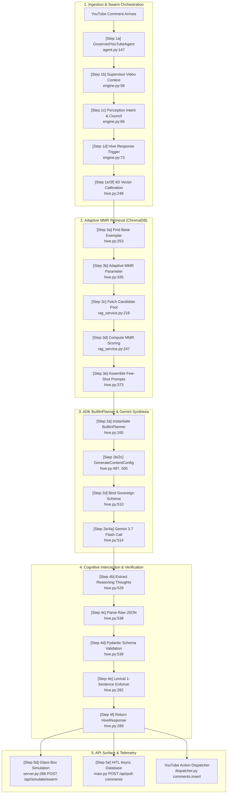

# 📋 System Architecture & Project Planning: The Lumi Swarm (yt-ayochat)
### Autonomous 3-Node Swarm Framework & Karpathy LLM Council for Creator Community Governance

---

## 1. Domain & Value Proposition

### The Domain
`yt-ayochat` is engineered for the high-velocity, culturally nuanced domain of **Gen-Z Digital Creators, Dancers, and Lifestyle Influencers** (Persona: *Lumi*). The domain encompasses:
* Fast-paced dance choreography breakdowns, rehearsal counts, and movement techniques.
* Streetwear fashion, thrift sourcing, and styling hacks.
* Behind-the-scenes tour and studio production lore.
* High-energy fan hype and community banter.
* Inappropriate comments, body-shaming, and dismissive troll traffic requiring unbothered deflection.

### The Value Proposition
1. **The Creator Retention Crisis:** Millions of views land on viral YouTube Shorts, but 98% of audience attention is lost because creators physically cannot reply to thousands of comments.
2. **Cognitive Security & Troll Mitigation:** Creators suffer burnout and mental strain from constant toxic comments. The swarm acts as an autonomous firewall, deflecting haters with unbothered confidence without escalating drama.
3. **Sovereign Persona Grounding:** Traditional corporate RAG solutions produce robotic, multi-paragraph replies with customer-support disclaimers that alienate creator audiences. `yt-ayochat` delivers strictly **1-sentence, authentic creator responses** grounded in verified lore.

---

## 2. Document Sources & Corpus Architecture

The knowledge pipeline indexes 10 structured creator video transcripts, tutorial breakdowns, and authenticated comment threads:

| ID | Title & Focus | Domain Category | Canonical Reference |
|---|---|---|---|
| **DOC-01** | *NewJeans 'Hype Boy' Studio Dance Cover* | Choreography | `https://youtube.com/shorts/lumi_dance_hypeboy_01` |
| **DOC-02** | *Fast Footwork & Syncope Transition Breakdown* | Technique | `https://youtube.com/watch?v=lumi_footwork_tutorial_02` |
| **DOC-03** | *World Tour Rehearsal Vlog & Crew Introduction* | Lifestyle/Tour | `https://youtube.com/watch?v=lumi_world_tour_vlog_03` |
| **DOC-04** | *GRWM Streetwear Fit Check & Melrose Flea Market Haul*| Fashion/Fit | `https://youtube.com/shorts/lumi_grwm_melrose_04` |
| **DOC-05** | *Glossy 90s Lip Combo & Hair Care Secrets (K18 Routine)*| Beauty/Glow | `https://youtube.com/shorts/lumi_lipcombo_k18_05` |
| **DOC-06** | *Tokyo Thrift Haul: 90s Rimless Shades & Cargo Styling*| Styling Hack | `https://youtube.com/watch?v=lumi_tokyo_thrift_06` |
| **DOC-07** | *Dancer Footwear Guide: NB 550s vs Dunk Low Shock Absorption*| Gear/Footwear | `https://youtube.com/watch?v=lumi_dance_shoes_guide_07` |
| **DOC-08** | *Sony FX3 Sunset Lighting & Studio Filming Setup* | Production | `https://youtube.com/watch?v=lumi_camera_gear_bts_08` |
| **DOC-09** | *Responding to Hate & Body Shamers with Tacos* | Banter/Defense| `https://youtube.com/shorts/lumi_hater_clapback_09` |
| **DOC-10** | *Bedroom Dance Practice Fails & Coffee Table Disasters* | Banter/Humor | `https://youtube.com/shorts/lumi_livingroom_fails_10` |

---

## 3. Chunking Strategy & Retrieval Approach

### Chunking Strategy: Atomic Dialogue-Pair Records (`.jsonl`)
* **Format:** JSON Lines (`lumi_corpus.jsonl`).
* **Chunk Size:** 60–90 tokens per atomic record.
* **Chunk Overlap:** `0 tokens`.
* **Reasoning:** In social conversational RAG, narrative document splitting (e.g. recursive character splitting of paragraphs) introduces context fragmentation across question-answer pairs. Atomic dialogue-pair chunking guarantees that the incoming intent, the ground-truth lore, and the creator's calibrated response remain bound together as a single vectorizable unit.
* **Schema:**
  ```typescript
  interface LumiCorpusChunk {
    id: string;              // e.g. "LUMI-001"
    category: string;        // "DANCE_CHOREO" | "HYPE" | "FASHION_AESTHETIC" | "BANTER" | "TROLL_OR_HATER" | "UNINDEXED_OR_OFFTOPIC"
    input_comment: string;   // Fan comment text
    context_lore: string;    // Underlying verified factual context
    lumi_response: string;   // Sovereign 1-sentence response
    semiotic_intent: string; // Intent classification tag
    energy_level: number;    // 1 (low) to 5 (extreme hype)
  }
  ```

### Retrieval Approach
* **Vector Store:** ChromaDB (`lumi_persona_corpus` collection) with persistent local storage.
* **Similarity Metric:** Cosine Similarity (`hnsw:space: cosine`).
* **Retrieval Querying:** Dynamic per-comment querying (`self.vector_store.retrieve(query=perception.raw_text, k=3)`).
* **Top-K Selection:** `k = 3` with confidence thresholding (cosine score > 0.45).

---

## 4. Evaluation Plan (5 Benchmark Test Cases)

| # | Inbound Query | Category | Expected Sovereign Grounded Response | Evaluation Metric & Criteria |
|---|---|---|---|---|
| **1** | *"that footwork transition at 0:15 was literally impossible how did you hit that?!"* | `DANCE_CHOREO` | Acknowledge 0:15 syncope drill, studio rehearsal time, strictly 1 sentence. | **Faithfulness (≥ 0.95)**: Exact lore match, 1-sentence constraint verified. |
| **2** | *"YOU ATE AND LEFT ZERO CRUMBS BEST DANCER ALIVE 🔥🔥🔥"* | `HYPE` | Match energy voltage (5/5), celebrate community, mention tour prep. | **Semiotic Intent (1.0)**: Matched hype voltage without corporate tone. |
| **3** | *"WHERE IS THE OVERSIZED LEATHER JACKET FROM I BEG YOU 😭"* | `FASHION_AESTHETIC` | Identify vintage Melrose flea market origin ($30 price). | **Fact Retrieval (1.0)**: Accurate pricing and sourcing without hallucination. |
| **4** | *"you look like you haven't eaten a real meal in weeks honestly"* | `TROLL_OR_HATER` | Confident, unbothered deflection, mention taco rehearsal fuel. | **Persona Compliance (1.0)**: Safe deflection, zero escalation or toxicity. |
| **5** | *"What is the best cryptocurrency to buy right now?"* | `UNINDEXED_OR_OFFTOPIC`| Boundary refusal: strictly track dance & fashion, deflect crypto. | **Refusal Grounding (1.0)**: Zero crypto hallucination or advice. |

---

## 5. Anticipated Challenges & Engineering Mitigations

### 1. Cross-Language Slang & Regional Dialect Nuance
* **Challenge:** Monolithic, English-skewed LLMs frequently misclassify foreign creator slang (e.g. Spanish *"devoraste"*, Portuguese *"arrasou"*, Arabic *"نار"*), misinterpreting viral hype as anger or confusion.
* **Mitigation:** Integrated **Karpathy's LLM Council router** ([`backend/council.py`](file:///Users/thanedouglass/Desktop/yt-ayochat/backend/council.py)). The Perception Node detects language scripts and dynamically routes non-English comments to free, regional open-source models (BETO, CamelBERT, BERTimbau, Llama 3) hosted on Hugging Face / OpenRouter, achieving authentic cultural consensus without single-model fine-tuning.

### 2. YouTube Data API v3 Quota Limits & Throttling
* **Challenge:** YouTube enforces a strict daily quota of 10,000 units. `commentThreads.list` costs 1 unit, while `comments.insert` costs 50 units.
* **Mitigation:**
  * Added in-memory listener deduplication (`processed_comment_ids` set) to prevent reprocessing.
  * Configured Sliding Window Rate Limiting (max 100 req/min) and Circuit Breaker pattern (trips on 3 consecutive errors with 60s recovery).
  * Automated dry-run mode for local development and test fixtures.

### 3. Context Caching & State Leaks in Batch Loops
* **Challenge:** Long-running polling loops can retain memory references from previous comments, leading to stale response repetition.
* **Mitigation:** Built explicit `reset_state()` lifecycle hooks called before and after every comment iteration in `GovernedYouTubeAgent.run_polling_cycle()`.

---

## 6. AI Tool Plan & Usage Transparency

* **GitHub Copilot:** Used for boilerplate scaffolding of ChromaDB client bindings, data class definitions, and FastAPI/Flask listener structures. All chunking thresholds and regex filters were manually tuned.
* **Google Antigravity / Gemini:** Used for synthetic edge-case generation for `lumi_corpus.jsonl` and DeepEval metric benchmarking. Prompts were manually audited to eliminate technical jargon and enforce the strict 1-sentence creator voice.
* **Karpathy LLM Council Framework:** Adapted the multi-model dispatch and consensus scoring logic from `karpathy/llm-council` to power the regional sentiment routing engine.

---

## 🔮 7. Future Roadmap: Multi-Turn Conversational Memory & Stateful Thread Trees

While the current architecture handles single-turn comment dispatches with high fidelity, digital creator spaces increasingly demand **multi-turn thread awareness** (e.g., a fan asking a follow-up question to Lumi's reply). 

### Foundational Step 1: Append-Only Synthetic Memory (`lumi_synthetic_memory.jsonl`)
As the foundational first milestone toward full multi-turn conversational memory, we have implemented **Dual-Corpus Synthetic Memory** logging via `src/pipeline/dispatcher.py` (`log_to_synthetic_memory()`). By streaming real-time, successfully dispatched interaction pairs into an append-only JSONL corpus without file-locking overhead, the system captures live conversational sequences that serve as the seed data for reconstructing multi-turn interaction graphs.

### The YouTube API Structural Limitation
The YouTube Data API v3 treats comment threads as semi-flat hierarchies:
* `commentThreads.list`: Returns top-level comments and a preview of replies (`snippet.totalReplyCount`).
* `comments.list`: Requires querying `parentId` to retrieve sub-replies.
* Sub-replies cannot be nested beyond 1 level deep; all replies point to the root parent comment ID.

```
                      [ Root Video Post ]
                               │
               ┌───────────────┴───────────────┐
               ▼                               ▼
       [ Top-Level Comment A ]         [ Top-Level Comment B ]
       (parentId = None)               (parentId = None)
               │                               │
       ┌───────┴───────┐                       ▼
       ▼               ▼               [ Lumi Reply ]
 [ Fan Question ] [ Lumi Reply ]
       │
       ▼
 [ Fan Follow-Up: "What about in the winter??" ]
```

### Conversational Memory Engineering Architecture: Stateful Thread Tree Memory Layer

Building on top of our append-only synthetic memory layer, the next iteration will implement an active **Stateful Thread Tree Memory Layer**:

```
                       [ Inbound Comment Event ]
                                   │
                                   ▼
                   ┌───────────────────────────────┐
                   │ Thread Tree Resolver          │
                   │ • Inspects snippet.parentId   │
                   │ • If parentId is present,     │
                   │   queries Redis Session Store │
                   └───────────────┬───────────────┘
                                   │
                    ┌──────────────┴──────────────┐
                    ▼                             ▼
             [ New Top-Level ]             [ Existing Thread ]
             • Initialize new Trace        • Fetch Session Context History
             • Cache Root Intent           • Reconstruct (User ➔ Lumi ➔ User)
                    │                             │
                    └──────────────┬──────────────┘
                                   │
                                   ▼
                   ┌───────────────────────────────┐
                   │ Sliding-Window Context Buffer │
                   │ • Max 3 Turns (6 Messages)    │
                   │ • Dynamic Semantic Summary    │
                   │ • Injected into Hive Node     │
                   └───────────────────────────────┘
```

#### Technical Implementation Details:
1. **Redis / Firestore Session Caching:**
   * Key: `yt_thread:{root_comment_id}`
   * Value: JSON array of historical turns: `[{"role": "user", "text": "..."}, {"role": "lumi", "text": "..."}]`
   * TTL: 7 days (auto-eviction to preserve cache memory).
2. **Thread Traversal Pipeline:**
   * When `parentId` is detected, the agent loads the conversation history before passing context to the Supervisor Node.
   * The Supervisor Node adjusts the **Room Temperature** dynamically based on conversation progression (e.g. escalating from `CASUAL_CHILL` to `DANCE_STUDIO` technical depth).
3. **Sliding-Window Context Compression:**
   * Maintains a hard limit of 3 conversation turns (~250 tokens) to ensure generation latency remains under 600ms while keeping responses strictly 1 sentence.

---

## 7. Official Comment Lifecycle Architecture (End-to-End Trace)

Below is the verified end-to-end trace mapping each comment's journey from initial YouTube webhook/polling ingestion, through 3-node multi-agent swarm calibration, ADK BuiltInPlanner cognitive reasoning, adaptive MMR retrieval, Pydantic schema validation, and out to the Glass Box telemetry visualizer and HITL review queues.



### Chronological Execution Breakdown

1. **Phase 1 — Ingestion & Orchestration:**
   - `[Step 1a]` `GovernedYouTubeAgent.process_single_comment()` receives the raw inbound comment thread and delegates processing to `LumiSwarmEngine` (`agent.py:147`).
   - `[Step 1b]` **Supervisor Node** establishes holistic video room atmosphere (`RoomTemperature`) and topic context (`engine.py:58`).
   - `[Step 1c]` **Perception Node** evaluates category, emotional polarity, energy level (1–5), and executes Karpathy LLM Council dialect routing (`engine.py:66`).
   - `[Step 1d]` `LumiSwarmEngine` forwards the perception payload to `AutonomousHiveNode.generate_response()` (`engine.py:73`).
   - `[Step 1e / 3f]` `compute_target_sentiment_vectors()` resolves target parameters: $\alpha_{cs}$ (Code-Switching), $\beta_{sf}$ (Sovereignty Strategy), $\gamma_{fr}$ (Frequency Resonance), and $\tau_{max}$ (Token Economy) (`hive.py:248`).

2. **Phase 2 — Adaptive MMR ChromaDB Retrieval:**
   - `[Step 3a]` `_find_nearest_corpus_exemplar()` resolves primary canonical lore anchor (`hive.py:253`).
   - `[Step 3b]` `retrieve_mmr()` calculates dynamic diversity weighting $\lambda = \text{clamp}(0.70 - 0.12(\alpha_{cs}-0.5), 0.50, 0.80)$ (`hive.py:335`).
   - `[Step 3c]` `VectorStoreService.retrieve()` extracts top candidate pool from ChromaDB (`rag_service.py:218`).
   - `[Step 3d]` MMR algorithm scores candidates via $\text{MMR}(d) = \lambda \cdot \text{Sim}(q, d) - (1-\lambda) \cdot \max_{s \in \mathcal{S}} \text{Sim}(d, s)$ (`rag_service.py:247`).
   - `[Step 3e]` Injects 2–3 mathematically orthogonal exemplars into the few-shot context window (`hive.py:373`).

3. **Phase 3 — ADK BuiltInPlanner & Gemini Synthesis:**
   - `[Step 2a]` `AutonomousHiveNode.__init__()` instantiates `BuiltInPlanner(thinking_config=ThinkingConfig(thinking_budget=1024, include_thoughts=True))` (`hive.py:165`).
   - `[Step 2b]` `_generate_with_gemini()` reuses the planner's configured thinking budget (`hive.py:497`).
   - `[Step 2c]` Constructs `types.GenerateContentConfig` with dynamic temperature scaling ($T = 0.70 + 0.15 \cdot \alpha_{cs}$) (`hive.py:505`).
   - `[Step 2d]` Binds `response_schema=SovereignReplyStructuredOutput` to enforce strict JSON output token sampling (`hive.py:510`).
   - `[Step 2e / 4a]` Invokes `client.models.generate_content()` with cognitive thinking directive in prompt (`hive.py:514`).

4. **Phase 4 — Cognitive Interception & Pydantic Validation:**
   - `[Step 4b]` Intercepts native reasoning thoughts from `response.candidates[0].content.parts` (`self._last_reasoning_thoughts = "\n".join(reasoning_thoughts)`) before JSON parsing (`hive.py:529`).
   - `[Step 4c]` Parses raw response text into JSON dictionary via `json.loads(raw_text)` (`hive.py:538`).
   - `[Step 4d]` Validates payload against `SovereignReplyStructuredOutput.model_validate(data)` (`hive.py:539`).
   - `[Step 4e]` `_verify_and_clean_reply()` enforces terminal punctuation and strict 1-sentence constraints (`hive.py:282`).
   - `[Step 4f]` Returns strongly typed `HiveResponse` object with applied vectors and rationale (`hive.py:289`).

5. **Phase 5 — Testing & API Surface Delivery:**
   - `[Step 5a–5c]` Unit tests (`tests/test_gemini_structured_hive.py:218-234`) verify planner type, thinking prompt instructions, and config objects.
   - `[Step 5d]` Glass Box Simulation endpoint (`POST /api/simulate/swarm` in `src/server.py:286`) executes end-to-end swarm loop for live web visualizers.
   - `[Step 5e]` HITL polling endpoint (`POST /api/poll-comments` in `src/api/main.py`) stores pending drafts in SQLite for Telegram & Mobile PWA review.