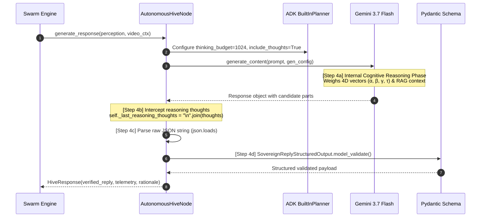

# Evolve yt-ayochat to YouTube Data API v3 Live Integration & Rebrand

This plan details the technical transition of `yt-ayochat` from a simulated CLI / API key pipeline to a live production integration with the YouTube Data API v3 using OAuth 2.0 authorization, alongside the branding transition to **Digital Autonomous Pollinators**.

## User Review Required

> [!IMPORTANT]
> **OAuth Desktop Flow Limitations:**
> The desktop OAuth consent flow (`google_auth_oauthlib.flow.InstalledAppFlow`) requires launching a local browser to complete the authorization. This works perfectly on a desktop machine with GUI (like your Mac development machine), but will hang on a headless/remote environment. We will design the authentication module to automatically load and refresh cached credentials from `token.json` if available, so that authorization only needs to be run interactively once.

> [!WARNING]
> **API Quota Utilization:**
> - `commentThreads().list()` costs **1 quota unit**.
> - `comments().list()` (used to check replies) costs **1 quota unit**.
> - `comments().insert()` (used to post replies) costs **50 quota units**.
> Default daily quota is 10,000 units. Running the agent in a tight continuous loop could exhaust your quota. We recommend introducing a configurable delay/sleep when using `--poll` or running a single-pass execution.

## Open Questions (Grilling on Technical Implementation)

Before making adjustments to the codebase, please review and answer the following technical design questions:

1. **How should we handle Author Channel ID resolution?**
   - *Option A (Dynamic - Recommended):* Resolve it dynamically on startup by calling `youtube.channels().list(mine=True, part="id")` using the OAuth credentials.
   - *Option B (Configuration):* Require the user to define the author's channel ID in `.env` / `config.py`.
   - *Recommendation:* Dynamic resolution ensures that the system always knows the channel ID of the currently authenticated account without manual configuration.

2. **How should we check if the author has already replied to a comment?**
   - *Option A (Replies scan):* If a comment thread's `totalReplyCount > 0`, fetch replies using `comments().list(parentId=comment_id)` and scan the list for the authenticated author's channel ID.
   - *Option B (Replies sample):* Use `commentThreads().list(part="snippet,replies")` and inspect the returned comments sample (which is limited to 5 items).
   - *Recommendation:* Option A is highly robust and avoids missing older author replies, but costs 1 additional quota unit per thread checked. Option B is cheaper but has a risk of missing the author's reply in highly active threads.

3. **How should `--video-id` interact with the main runner?**
   - When `--video-id <id>` is provided with `--poll`:
     - Should it execute a **single polling run** and exit?
     - Or should it poll **continuously** at a specified interval (e.g., every 60 seconds)?
   - When `--video-id` is provided without `--poll` (e.g., with `--query` or on its own), how should it behave?

4. **Rebrand Naming and Terminology:**
   - We will update the `README.md` hero and codebase docstrings to refer to the system as a **Digital Autonomous Pollinator** (Social Software Agent) that harvests *Pollen* (Fleeting Attention), matches it with *Nectar* (RAG Lore Database), and *Cross-Pollinates* viewers. Does this align with your vision?

---

## Proposed Changes

### Dependencies & Config

#### [MODIFY] [requirements.txt](file:///Users/thanedouglass/Desktop/yt-ayochat/requirements.txt)
- Add `google-auth-httplib2` and `google-auth-oauthlib`.

#### [MODIFY] [.gitignore](file:///Users/thanedouglass/Desktop/yt-ayochat/.gitignore)
- Strictly exclude credentials/tokens:
  ```
  client_secret.json
  token.json
  ```

#### [MODIFY] [config.py](file:///Users/thanedouglass/Desktop/yt-ayochat/src/config.py)
- Support paths for `client_secret.json` and `token.json` dynamically via AppConfig.

---

### Authentication Module

#### [NEW] [auth.py](file:///Users/thanedouglass/Desktop/yt-ayochat/src/pipeline/auth.py)
- Create desktop-based OAuth 2.0 flow:
  1. Look for `token.json`. If found, load it and refresh the token if expired.
  2. If not found/expired-without-refresh, use `InstalledAppFlow` to load `client_secret.json`, request `https://www.googleapis.com/auth/youtube.force-ssl` scope, launch a local webserver for authentication consent, and save credentials to `token.json`.
  3. Return the authenticated `googleapiclient.discovery.Resource` (YouTube API v3 client) and resolve/cache the authenticated Channel ID.

---

### Ingestion & Inbound listener

#### [MODIFY] [listener.py](file:///Users/thanedouglass/Desktop/yt-ayochat/src/pipeline/listener.py)
- Update `YouTubeCommentListener` to:
  - Take the authenticated YouTube client instead of a developer key.
  - Determine if the authenticated Channel ID has already replied to each top-level comment.
  - Exclude comments where the author channel has already left a reply.

---

### Action Dispatcher

#### [MODIFY] [dispatcher.py](file:///Users/thanedouglass/Desktop/yt-ayochat/src/pipeline/dispatcher.py)
- Refactor `ActionDispatcher` to:
  - Accept and use the authenticated OAuth client for write operations.
  - Call `comments().insert()` under the parent `commentId` with the generated response payload.

---

### Main Execution & Agent Interface

#### [MODIFY] [agent.py](file:///Users/thanedouglass/Desktop/yt-ayochat/src/agent.py)
- Modify `GovernedYouTubeAgent` constructor to initialize using the authenticated client from `auth.py`.
- Pass authenticated details downstream to `listener` and `dispatcher`.

#### [MODIFY] [run_agent.py](file:///Users/thanedouglass/Desktop/yt-ayochat/scripts/run_agent.py)
- Add `--video-id` parameter.
- Resolve the authenticated YouTube service and feed video/polling params into the agent pipeline.

---

### Rebranding

#### [MODIFY] [README.md](file:///Users/thanedouglass/Desktop/yt-ayochat/README.md)
- Rebrand headers, description, system diagram terminology, and terminology (Pollen, Nectar, Pollinator) to match the vision of Digital Autonomous Pollinators.

---

## Verification Plan

### Automated Tests
- Create unit tests with mocked YouTube API endpoints to verify:
  - OAuth credentials checking and refreshing behavior.
  - Top-level comment retrieval and filtering logic (checking replies).
  - Replying to comments via `comments().insert()`.
- Command: `pytest tests/`

### Manual Verification
- Place a test `client_secret.json` in the root.
- Execute `python -m scripts.run_agent --poll --video-id <YOUR_TEST_VIDEO_ID>` to verify the browser popup opens, authentication completes, and comments are fetched/replied to in a real YouTube thread.

---

## 🪟 The Glass Box: Cognitive Transparency & Reasoning Extraction

Traditional autonomous agents operate as black boxes: inputs enter, and raw textual outputs are emitted without intermediate verification. In the **Lumi Swarm**, the Hive Node implements a **Cognitive Transparency Layer** utilizing Google ADK's `BuiltInPlanner` and Gemini's native thinking mode to inspect and intercept the agent's internal reasoning loop before final response generation.



### Cognitive Security & Verification Mechanics

1. **Step 4a — Generation with Reasoning (`hive.py:514`):**
   Gemini 3.7 Flash processes the inbound comment alongside video context, 4D sentiment vectors, and few-shot exemplars under `types.GenerateContentConfig(thinking_config=ThinkingConfig(thinking_budget=1024, include_thoughts=True))`.

2. **Step 4b — Thought Interception (`hive.py:529`):**
   Before parsing the candidate text into downstream structures, the Hive node iterates through `response.candidates[0].content.parts`, extracting parts with `part.thought == True`:
   ```python
   reasoning_thoughts = []
   if hasattr(response, "candidates") and response.candidates:
       for candidate in response.candidates:
           if hasattr(candidate, "content") and candidate.content and candidate.content.parts:
               for part in candidate.content.parts:
                   if getattr(part, "thought", False) and getattr(part, "text", None):
                       reasoning_thoughts.append(part.text)
   self._last_reasoning_thoughts = "\n".join(reasoning_thoughts) if reasoning_thoughts else None
   ```

3. **Step 4c — Raw JSON Extraction & Guarded Parse (`hive.py:538`):**
   The non-thought text payload is extracted, sanitized, and parsed via `json.loads(raw_text)` before being passed to schema validation.

### Cognitive Security Significance
- **Auditability & Traceability:** The intercepted reasoning thoughts provide verifiable proof of why a particular tone, code-switching level ($\alpha_{cs}$), or sovereignty strategy ($\beta_{sf}$) was selected.
- **Immunity from Hallucination Loops:** If an adversarial prompt attempts a delimiter breakout, the thinking phase intercepts the malicious payload and explicitly reasons through a deflection strategy before emitting any text.
- **Telemetry Exposure:** Extracted thoughts are streamed directly into the Glass Box Telemetry Dashboard (`/api/telemetry/audit-feed`), providing researchers and creators complete visibility into agent cognition.

