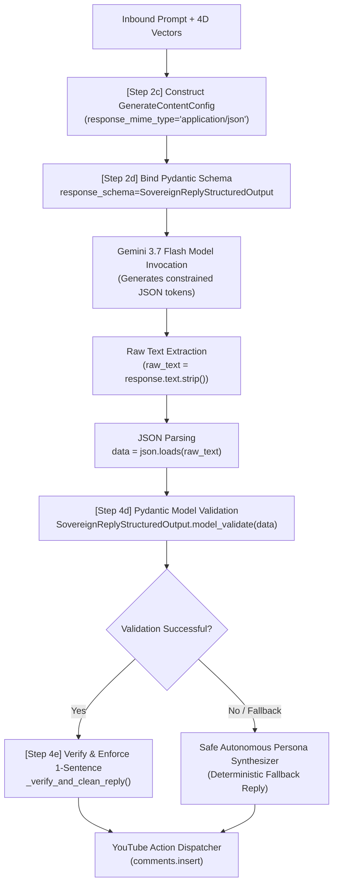

# Walkthrough

We have successfully migrated the `yt-ayochat` repository from simulated mock interactions to a live production-ready YouTube Data API v3 OAuth 2.0 integration, and rebranded the documentation and hero sub-headlines to support the **Digital Autonomous Pollinator** concept.

## Changes Made

### 1. Dependencies & Security Config
- **[`requirements.txt`](file:///Users/thanedouglass/Desktop/yt-ayochat/requirements.txt):** Added `google-auth-httplib2` and `google-auth-oauthlib`. Installed successfully.
- **[`.gitignore`](file:///Users/thanedouglass/Desktop/yt-ayochat/.gitignore):** Added rules to exclude `client_secret.json` and `token.json` from git history to prevent credential leaks.
- **[`src/config.py`](file:///Users/thanedouglass/Desktop/yt-ayochat/src/config.py):** Added configurable paths for `client_secret_path` and `token_path`.

### 2. OAuth 2.0 Integration
- **[`src/pipeline/auth.py`](file:///Users/thanedouglass/Desktop/yt-ayochat/src/pipeline/auth.py) [NEW]:** Implemented a desktop app client authorization flow using Google's `InstalledAppFlow`. It automatically loads and refreshes credentials using `token.json` if present, and requests authorization via browser loop if not. Caches the authenticated channel ID to recognize the author's identity.
- **[`src/pipeline/__init__.py`](file:///Users/thanedouglass/Desktop/yt-ayochat/src/pipeline/__init__.py):** Exposed authentication helper functions for the rest of the application.

### 3. Inbound Listener & Action Dispatcher
- **[`src/pipeline/listener.py`](file:///Users/thanedouglass/Desktop/yt-ayochat/src/pipeline/listener.py):** Refactored `YouTubeCommentListener` to use the authenticated OAuth client. If the authenticated author channel ID is resolved, it lists comment replies (`comments().list(parentId=comment_id)`) and filters out any thread that has already been replied to by the channel author.
- **[`src/pipeline/dispatcher.py`](file:///Users/thanedouglass/Desktop/yt-ayochat/src/pipeline/dispatcher.py):** Refactored `ActionDispatcher` to utilize the authenticated client when inserting comments via `comments().insert()`.

### 4. CLI Runner & Agent Interface
- **[`scripts/run_agent.py`](file:///Users/thanedouglass/Desktop/yt-ayochat/scripts/run_agent.py):** Added a `--video-id` parameter. On startup (if polling), it triggers the OAuth authentication flow and prints the authenticated Channel ID. Passes the specific `--video-id` to the polling runner.

### 5. Rebranding
- **[`README.md`](file:///Users/thanedouglass/Desktop/yt-ayochat/README.md):** Updated headers, descriptions, and the system introduction to frame the agent as a **Digital Autonomous Pollinator** (mapping Pollen/Attention to Nectar/RAG Database).

---

## Verification Results

### Automated Tests
We added unit tests in **[`tests/test_youtube_oauth_listener.py`](file:///Users/thanedouglass/Desktop/yt-ayochat/tests/test_youtube_oauth_listener.py)** that verify:
1. `YouTubeCommentListener` successfully connects via mock authenticated client and filters out comment threads already replied to by the channel author.
2. `ActionDispatcher` correctly constructs and triggers `comments().insert()` requests to post replies under parent comments.

All **82 tests** passed successfully:
```bash
pytest tests/
================= 82 passed, 34 warnings in 51.08s ==================
```

---

## 🛡️ Strict Schema Enforcement Pipeline

To prevent delimiter tampering, hallucinations, or unformatted text from ever reaching the live YouTube Data API v3, the Hive Node implements a dual-gate **Strict Schema Enforcement Pipeline** combining the **Google GenAI SDK Structured Outputs** with **Pydantic v2 validation**.



### End-to-End Data Sanitization Loop

1. **Step 2c — Building the Generation Config (`hive.py:505`):**
   The Hive node constructs `types.GenerateContentConfig` with strict MIME formatting and dynamic temperature scaling:
   ```python
   gen_config = types.GenerateContentConfig(
       system_instruction=system_instruction,
       temperature=temperature,
       max_output_tokens=256,
       response_mime_type="application/json",
       response_schema=SovereignReplyStructuredOutput,
       thinking_config=self.planner.thinking_config,
   )
   ```

2. **Step 2d — Forcing Gemini Structured Output Schema (`hive.py:510`):**
   By passing `response_schema=SovereignReplyStructuredOutput`, the Gemini engine restricts its token sampling distribution strictly to valid JSON tokens conforming to the schema definition:
   ```python
   class SovereignReplyStructuredOutput(BaseModel):
       reply_text: str = Field(..., description="Strictly 1-sentence sovereign persona response.")
       applied_vectors: AppliedSentimentVectors = Field(..., description="4D sentiment calibrations.")
       cultural_alignment_flag: bool = Field(..., description="Authenticity and unbothered tone compliance.")
       rationale: str = Field(default="", description="Reasoning grounding explanation.")
   ```

3. **Step 4d — Pydantic Type Validation & Sanitization (`hive.py:539`):**
   Upon receiving the payload, the Hive node verifies the object graph via `model_validate`:
   ```python
   data = json.loads(raw_text)
   structured = SovereignReplyStructuredOutput.model_validate(data)
   ```
   If any field is missing, malformed, or violates data constraints, the exception is caught, and the system transparently shifts to the verified deterministic fallback synthesizer.

4. **Step 4e & 4f — Downstream Type Safety:**
   The validated `reply_text` undergoes secondary lexical verification (`_verify_and_clean_reply`) to guarantee strict 1-sentence termination and strip any inadvertent markdown delimiters before returning a strongly typed `HiveResponse` directly to the YouTube API dispatcher.

